# Local setup of keycloak for Sunbird

This readme file provides instructions for setting up keycloak for sunbird in a local machine.

### System Requirements

### Prerequisites

- Java 11
- Latest Docker

### Steps for local setup

To set up the keyloak for sunbird in local, follow the steps below:

1. Clone the latest branch of the 'sunbird-lms-service' using the below command and checkout branch '4.8.27_k24':
```shell
git clone https://github.com/Sunbird-Lern/sunbird-lms-service.git
```

2. Execute the shell script present in the path `<project-base-path>/sunbird-lms-service/keycloak-local-setup/keycloak-24.0.4`:
```shell
chmod +x keycloak_docker.sh
sh keycloak_docker.sh
```
Note: Modify 'keycloak_docker.sh' file using a text editor to prepend 'sudo ' to all docker commands if you don't have root user permissions. Example: 
```
sudo docker network create keycloak-postgres-network
```

Shell script will end like below output:
```
=========================================
Keycloak 24.0.4 setup completed!
=========================================
Keycloak Admin Console: http://localhost:8080
Username: admin
Password: sunbird

PostgreSQL Database:
Host: localhost:32769
Database: keycloakdb
Username: kcpgadmin
Password: kcpgpassword
=========================================
Container status:
CONTAINER ID   IMAGE                              COMMAND                  CREATED              STATUS              PORTS                                                   NAMES
718711ae2781   quay.io/keycloak/keycloak:24.0.4   "/opt/keycloak/bin/k…"   56 seconds ago       Up 20 seconds       0.0.0.0:8080->8080/tcp, [::]:8080->8080/tcp, 8443/tcp   kc_local
943722cdfc62   postgres:15.14                     "docker-entrypoint.s…"   About a minute ago   Up About a minute   0.0.0.0:32769->5432/tcp, [::]:32769->5432/tcp           kc_postgres

To view Keycloak logs: docker logs kc_local
To view PostgreSQL logs: docker logs kc_postgres

```

3. Wait for the script to complete execution and make sure the keycloak container and postgres container creation is successful before proceeding to the next step using the below command: 
```shell
docker ps -a
```
Note: Prepend 'sudo ' to above command if you don't have root user permissions.

Verify docker containers exists with names 'kc_local' and 'kc_postgres' and are running.

4. Command to connect to postgres database:
```shell
docker exec -it kc_postgres psql -U kcpgadmin -d keycloakdb
```

5. To verify if keycloak for sunbird is configured,
   - login to keycloak ( http://localhost:8080/ - use keycloak credentials mentioned in 'keycloak_docker.sh').
   - Check if 'Sunbird' realm is selected.
   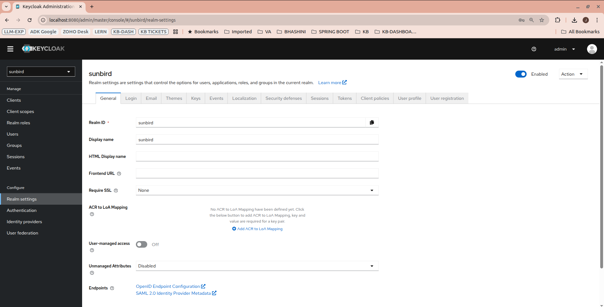
   - Check if 'sunbird' is available as an option under 'Themes' realm sub-menu for 'Login Theme' and 'Email Theme'.
   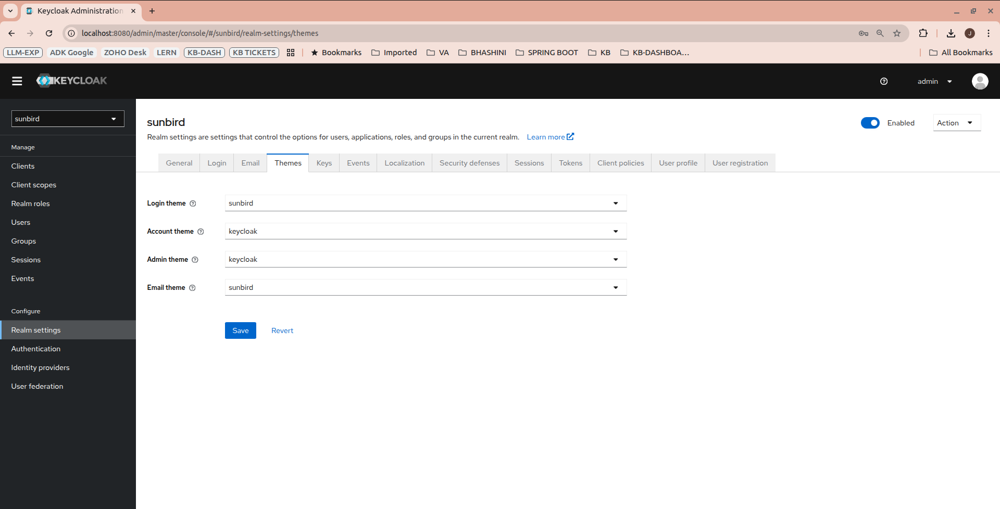
   - Check if 'cassandra-storage-provider' is present under 'User Federation' configuration menu. Open 'Cassandra-storage-provide'. 
   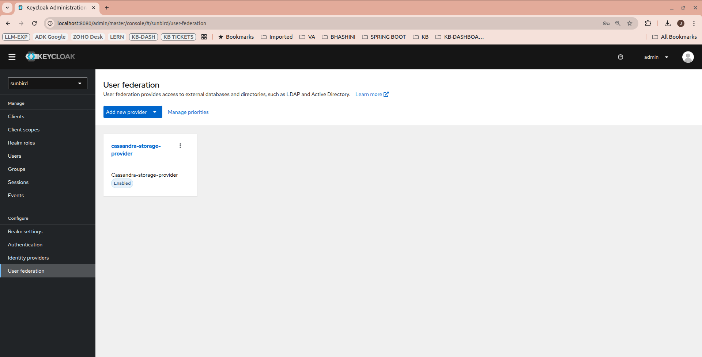
   - Check if clients (admin-cli, lms, android, etc.) are available. Enable clients if not enabled.
   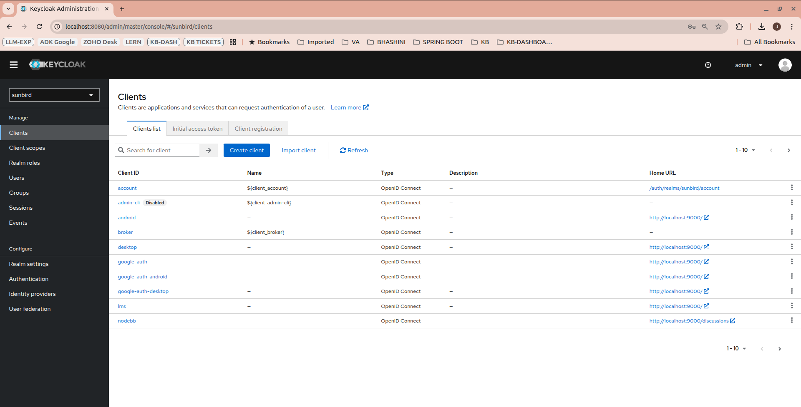
     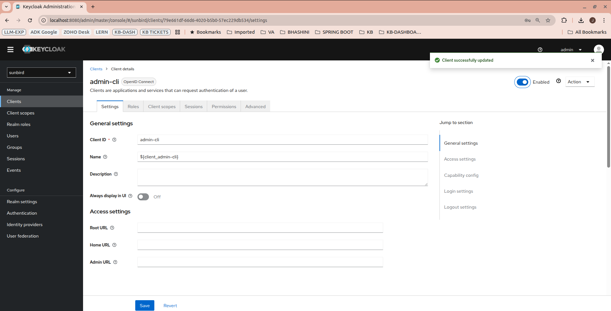
6. Open 'LMS' client from 'Clients' Menu. Go to 'Service Account Roles' tab. Click on 'Assign Role' and add 'admin' role as shown
   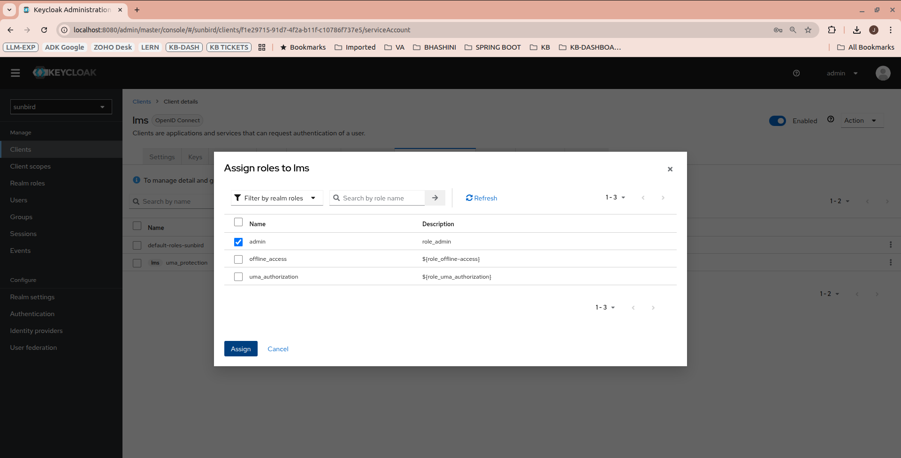

7. Click on "Assign role" button, select 'Filter by clients' in the dropdown. Look for the 'realm-management manage-users' client in the list.
   Select manage-users role and Click "Assign"
   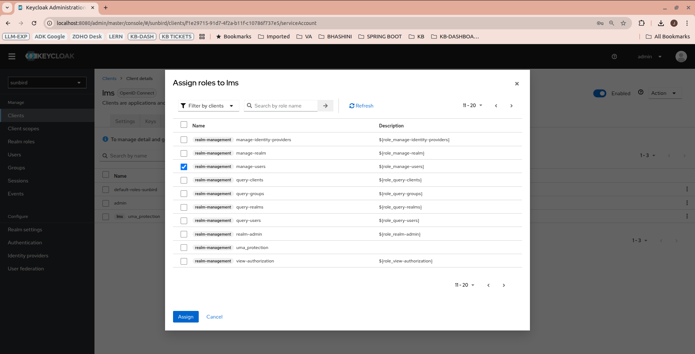

8. In 'Settings' tab of 'LMS' client, enable 'Direct Access Grants Enabled' and click 'Save' button. This will allow the LMS client to authenticate users using username and password.
   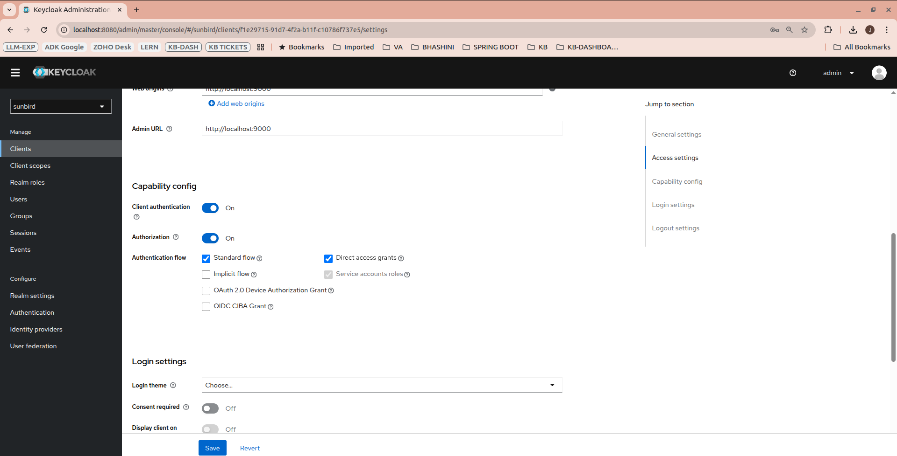

9. In 'Credentials' tab of 'LMS' client, click on 'Regenerate' button against 'Client Secret' with 'Client Authenticator' as 'Client Id and Secret'. Copy the client secret value. This is the value to be saved for 'sunbird_sso_client_secret' config variable while integration with 'sunbird-lms-service'. (sunbird_sso_client_id = lms, sunbird_sso_client_secret = newly generated secret)
    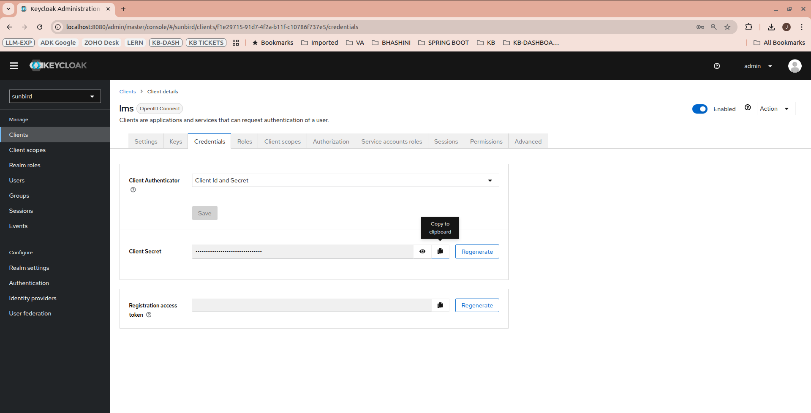

10. Fetch cassandra-provider-id using below commands. This is the value to be saved for 'sunbird_keycloak_user_federation_provider_id' config variable while integration with 'sunbird-lms-service'.
```commandline
chmod +x scripts/fetch_provider_id.sh
./scripts/fetch_provider_id.sh
```
   The output will be like below:
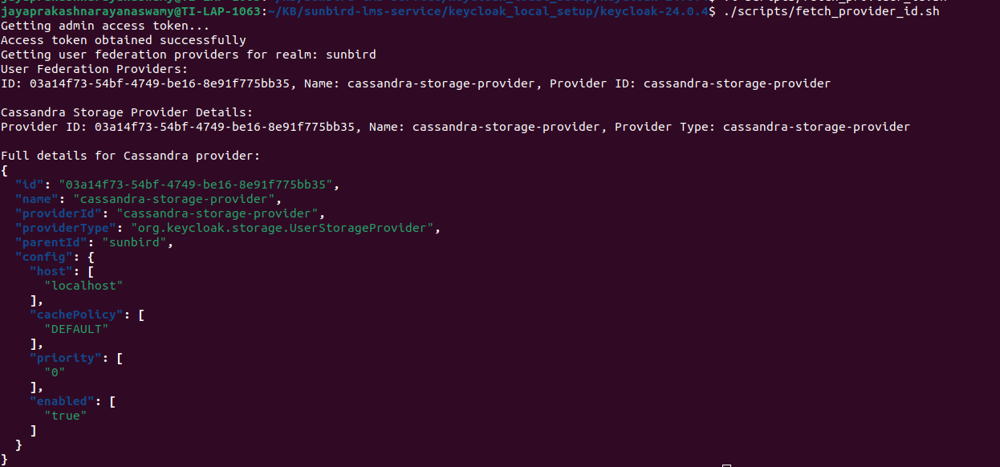


11. Click on 'Realm settings' menu on the left side. Go to 'Keys' tab. Copy the Kid and public key value of 'RS256' algorithm. 
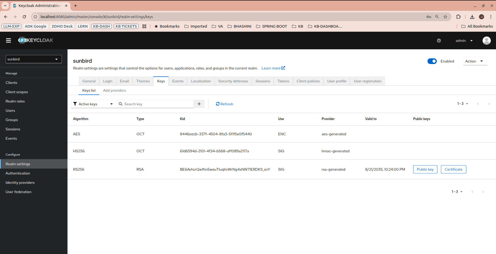


12. Create a folder named 'keys' in the 'sunbird-lms-service' project. Create a file with name as 'kid' value and paste the public key value in that file. 'Kid' is the value to be saved for 'sunbird_sso_publickey' config variable while integration with 'sunbird-lms-service'.
   Example: If kid is 'BE6AvhcrQwfhn5wouTIuqlmWrNg4sNW71ERDK1I_svY', create a file named 'BE6AvhcrQwfhn5wouTIuqlmWrNg4sNW71ERDK1I_svY' in 'keys' folder and paste public key value in that file.
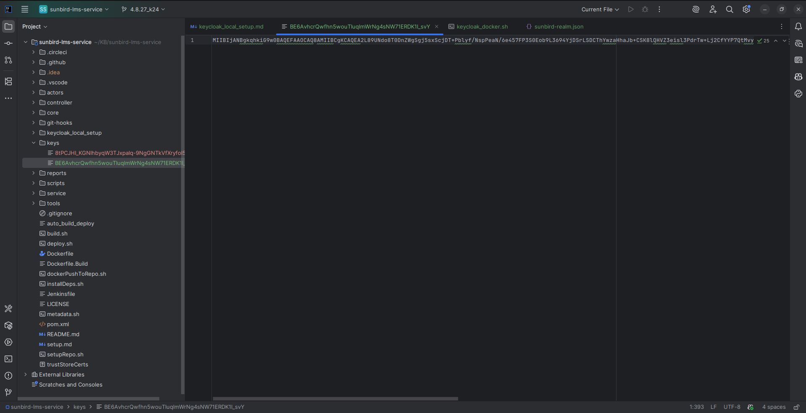


3. Local 'sunbird-lms-service'  setup keycloak related configurations will be as follows:
```shell
sunbird_keycloak_user_federation_provider_id=03a14f73-54bf-4749-be16-8e91f775bb35 
sunbird_sso_url=http://localhost:8080/
sunbird_sso_realm=sunbird
sunbird_sso_client_id=lms
sunbird_sso_client_secret=0HuiV0gVmWtYNq02teAhEIGyhBmyNlzf
sunbird_sso_publickey=BE6AvhcrQwfhn5wouTIuqlmWrNg4sNW71ERDK1I_svY
sunbird_sso_username=admin
sunbird_sso_password=sunbird
sunbird_pg_db=keycloakdb
sunbird_pg_user=kcpgadmin
sunbird_pg_password=kcpgpassword
```


### Understanding keycloak on Sunbird
Please refer to https://project-sunbird.atlassian.net/l/cp/St3y353z for understanding keycloak on sunbird and user authentication flows.

### Steps for integrating local keycloak setup with local 'sunbird-lms-service' setup
1. Ensure postgres and keycloak containers are up and running.
2. Ensure environment variables are exported with values from keycloak as mentioned above in 'Step 13'.
```commandline
export sunbird_keycloak_user_federation_provider_id=03a14f73-54bf-4749-be16-8e91f775bb35 
export sunbird_sso_url=http://localhost:8080/
export sunbird_sso_realm=sunbird
export sunbird_sso_client_id=lms
export sunbird_sso_client_secret=0HuiV0gVmWtYNq02teAhEIGyhBmyNlzf
export sunbird_sso_publickey=BE6AvhcrQwfhn5wouTIuqlmWrNg4sNW71ERDK1I_svY
export sunbird_sso_username=admin
export sunbird_sso_password=sunbird
export sunbird_pg_db=keycloakdb
export sunbird_pg_user=kcpgadmin
export sunbird_pg_password=kcpgpassword
```
3. Ensure public key from 'sunbird' realm is copied as file under 'keys' folder with 'kid' as file name. Add below variable to 'externalresources.properties' after updating '$PATH_TO_WORKSPACE' value.
```
accesstoken.publickey.basepath=$PATH_TO_WORKSPACE/keys/
# ex: /home/jayaprakashnarayanaswamy/KB/sunbird-lms-service/keys/
```
4. Add CORS filter to 'application.conf' in controller folder of 'sunbird-lms-service'.
```shell
  enabled += "play.filters.cors.CORSFilter"
```
5. Comment all lines in 'validateChannelAndOrganisationId' method of SSOUserServiceImpl.java file. This is to avoid validation of channel and organisation id during local setup. This is required as the local keycloak setup does not have any channels or organisations created.
6. Go to 'sunbird-lms-service' project base path and run the below command to build the service.
```shell
mvn clean install -DskipTests
```
7. Go to 'sunbird-lms-service' project base path and run the below command to start the service.
```shell
cd controller
MAVEN_OPTS="--add-opens=java.base/java.lang=ALL-UNNAMED --add-opens=java.base/java.lang.reflect=ALL-UNNAMED --add-opens=java.base/java.net=ALL-UNNAMED --add-opens=java.base/java.util=ALL-UNNAMED --add-opens=java.base/sun.nio.ch=ALL-UNNAMED" mvn play2:run
```


### Steps to create admin user and other tenant users
1. Login to keycloak and go to 'Users' on the left side menu. Click 'Add user' button. Enter user details and 'Save'.
    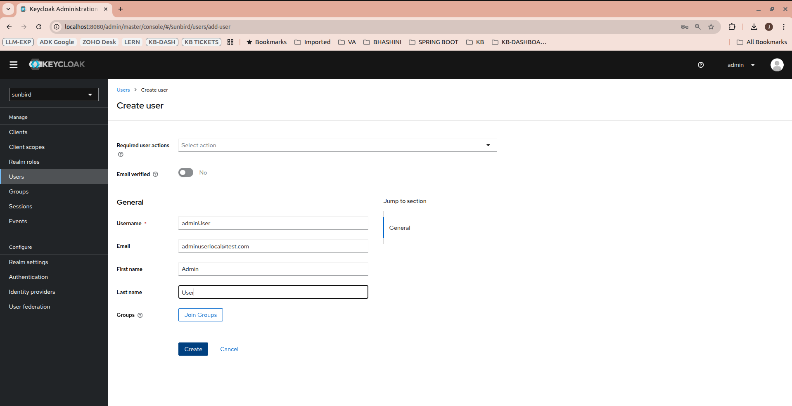
2. As Admin user gets created, search for adminuser in 'Users' left side menu. Search for the adminuser. Click on adminuser and go to 'Role Mappings' sub menu of the adminuser. Add 'admin' to 'Assigned Roles'.
    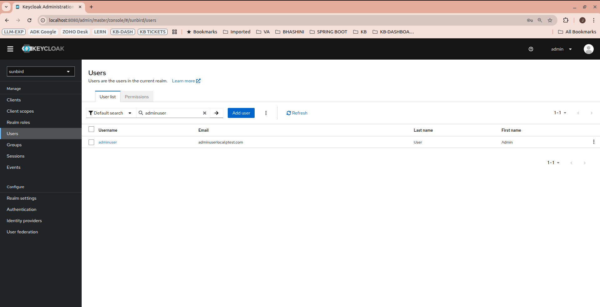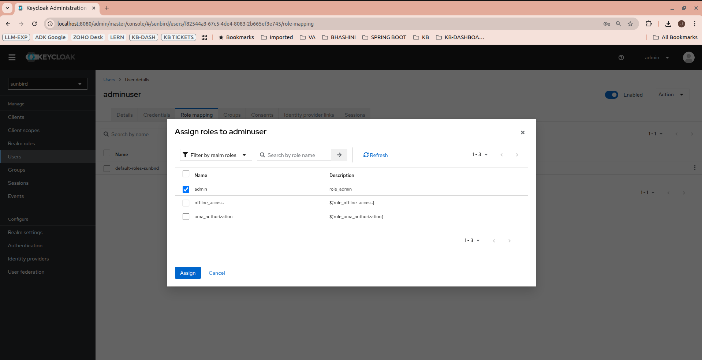
3. In 'Role Mappings' sub menu, click on "Assign role" button, select 'Filter by clients' in the dropdown. Look for the 'realm-management manage-users' client in the list.
   Select manage-users role and Click "Assign"
    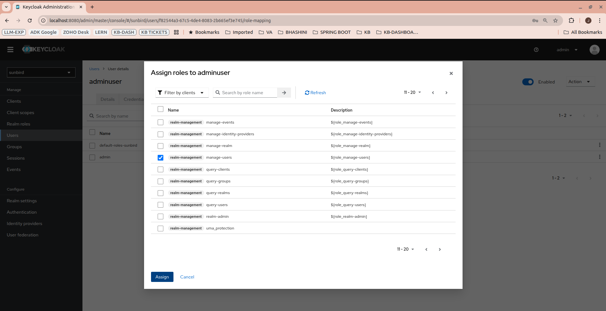
4. Go to 'Credentials' sub menu and click 'Set password' to set the password for admin user. Disable 'Temporary' checkbox and click 'Set Password'.
    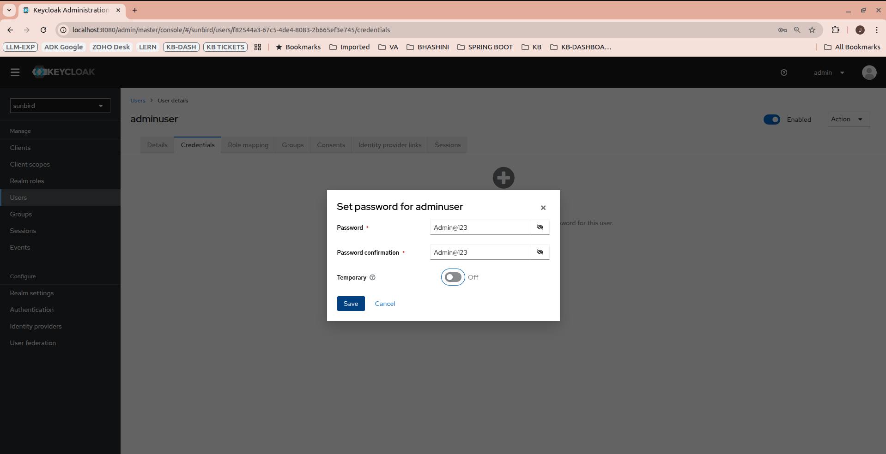
5. Go to 'Details' sub menu and click 'Save' button.

Now you can generate token for creating users via below CURL using admin user access token.
   - CURL TO GENERATE USER TOKEN:
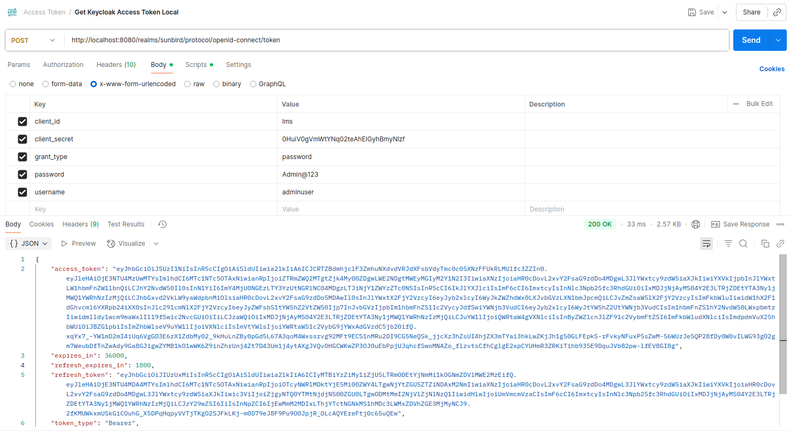
```shell
curl --location 'http://localhost:8080/realms/sunbird/protocol/openid-connect/token' \
--header 'Content-Type: application/x-www-form-urlencoded' \
--data-urlencode 'client_id=lms' \
--data-urlencode 'client_secret=0HuiV0gVmWtYNq02teAhEIGyhBmyNlzf' \
--data-urlencode 'grant_type=password' \
--data-urlencode 'password=Admin@123' \
--data-urlencode 'username=adminuser'
```
Copy "access_token" value from the response and use as create user CURL 'x-authenticated-user-token' header's value.

  - CURL TO CREATE TENANT USER:  
    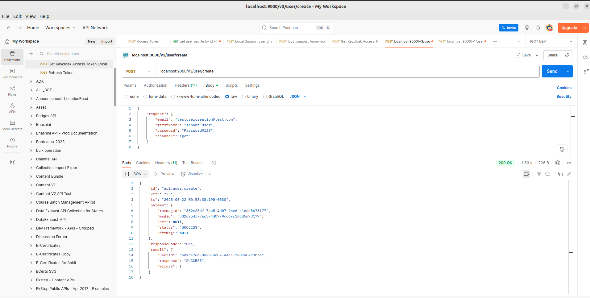
```shell
curl --location --request POST 'localhost:9000/v3/user/create' \
--header 'Content-Type: application/json' \
--header 'x-authenticated-user-token: #access_token value of adminuser' \
--data-raw '{
    "request": {
        "email": "testusercreation@test.com",
        "firstName": "Tenant User",
        "password": "Test@123",
        "channel":"igot"
    }
}'
```
6. Ensure you are able to generate user token for the newly created user
```shell
curl --location --request POST 'localhost:8080/realms/sunbird/protocol/openid-connect/token' \
--header 'Content-Type: application/x-www-form-urlencoded' \
--data-urlencode 'client_id=lms' \
--data-urlencode 'client_secret=0HuiV0gVmWtYNq02teAhEIGyhBmyNlzf' \
--data-urlencode 'grant_type=password' \
--data-urlencode 'username=testusercreation@test.com' \
--data-urlencode 'password=Test@123'
```

7. Another way is to open localhost login page: http://localhost:8080/realms/sunbird/protocol/openid-connect/auth?client_id=lms&response_type=code&scope=openid&redirect_uri=http://localhost:9000
8. Use below command to check keycloak logs. Login with the newly created user credentials. All 'sunbird-lms-service' requests should be returned successfully.
```commandline
docker logs -f kc_local
```
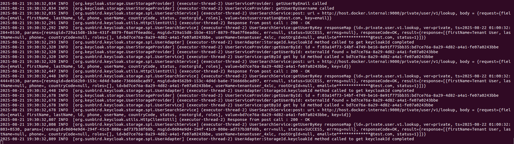


### Steps to perform token validation


For server side token validation, please refer to https://project-sunbird.atlassian.net/wiki/spaces/DevOps/pages/3274276929/Adminutils+on+Sunbird
